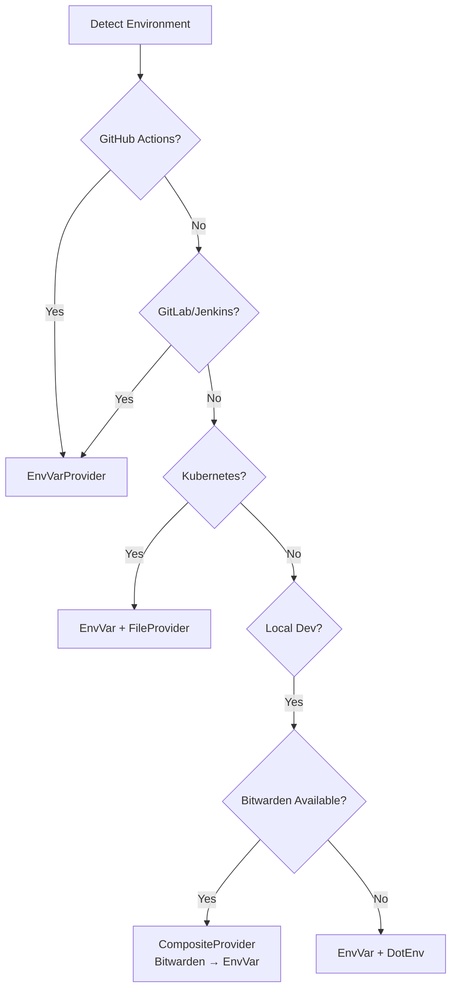

# Secret Management System Documentation

## Overview

VSCodePiloter includes a **universal secret management system** that works seamlessly across different environments:

- 🏠 **Local Development** - Bitwarden Secrets Manager
- 🔄 **CI/CD** - GitHub Actions, GitLab CI, Jenkins
- 🐳 **Containers** - Docker, Kubernetes
- ☁️ **Cloud** - AWS, Azure, Google Cloud

The system **automatically detects** your environment and uses the appropriate secret backend.

---

## Quick Start

### Basic Usage (Auto-Detection)

```python
from agent.secrets import get_secret_provider

# Automatically detects environment and creates appropriate provider
provider = get_secret_provider()

# Retrieve a secret
api_key = provider.get_secret("ZAI_API_KEY")
```

### With LLM Client

```python
from agent.llm_client import create_llm_client
from agent.config import LLMConfig

# Create LLM with auto-detected secret provider
config = LLMConfig(api_key_env="ZAI_API_KEY")
llm = create_llm_client(config, secret_provider=True)
```

---

## Architecture

### Provider Hierarchy

```
SecretProvider (Abstract Base)
├── EnvVarProvider        # Environment variables
├── DotEnvProvider        # .env files
├── BitwardenProvider     # Bitwarden Secrets Manager
├── CompositeProvider     # Fallback chains
└── [Future] CloudProviders
    ├── AWSSecretsProvider
    ├── AzureKeyVaultProvider
    └── GoogleSecretProvider
```

### Auto-Detection Logic



---

## Environment-Specific Configuration

### Local Development (Bitwarden)

**Setup:**
1. Install Bitwarden CLI: `winget install Bitwarden.BWS`
2. Set access token: `$env:BWS_ACCESS_TOKEN = "your-token"`
3. Store secrets in Bitwarden vault

**Usage:**
```python
from agent.secrets import BitwardenProvider

provider = BitwardenProvider()
api_key = provider.get_secret("Z_AI_API_KEY")
```

**Benefits:**
- ✅ Centralized secret management
- ✅ Team sharing capabilities
- ✅ Audit logging
- ✅ Never commit secrets to git

### GitHub Actions

**Setup in `.github/workflows/agent.yml`:**

```yaml
jobs:
  run-agent:
    runs-on: ubuntu-latest
    steps:
      - uses: actions/checkout@v4

      - name: Run Agent
        env:
          ZAI_API_KEY: ${{ secrets.ZAI_API_KEY }}
        run: |
          # Auto-detects GitHub Actions, uses EnvVarProvider
          python -m agent.main
```

**Alternative with Bitwarden:**

```yaml
      - name: Run with Bitwarden
        env:
          BWS_ACCESS_TOKEN: ${{ secrets.BWS_ACCESS_TOKEN }}
        run: |
          # Install bws CLI
          curl -L https://github.com/bitwarden/sdk/releases/latest/download/bws-x86_64-unknown-linux-gnu.tar.gz | tar xz

          # Run with Bitwarden secrets
          ./bws run -- python -m agent.main
```

### Docker

**Dockerfile:**
```dockerfile
FROM python:3.11

WORKDIR /app
COPY . .
RUN pip install -e .

# Secrets passed as environment variables
CMD ["python", "-m", "agent.main"]
```

**Run with secrets:**
```bash
# Using environment variables
docker run -e ZAI_API_KEY=$ZAI_API_KEY vscode-piloter

# Using Bitwarden
docker run -e BWS_ACCESS_TOKEN=$BWS_ACCESS_TOKEN vscode-piloter
```

### Kubernetes

**Secret manifest:**
```yaml
apiVersion: v1
kind: Secret
metadata:
  name: agent-secrets
type: Opaque
data:
  ZAI_API_KEY: <base64-encoded-key>
```

**Pod with secrets:**
```yaml
apiVersion: v1
kind: Pod
spec:
  containers:
  - name: agent
    image: vscode-piloter
    envFrom:
    - secretRef:
        name: agent-secrets
```

---

## Provider Reference

### EnvVarProvider

Reads secrets from environment variables.

**Configuration:**
```python
provider = EnvVarProvider({
    "prefix": "APP_",      # Prefix for all keys
    "uppercase": True,     # Convert keys to uppercase
    "strip_prefix": False  # Remove prefix from listed keys
})
```

**Example:**
```python
# With prefix, looking for APP_SECRET
value = provider.get_secret("SECRET")

# List all with prefix
secrets = provider.list_secrets()  # ["APP_KEY1", "APP_KEY2"]
```

### BitwardenProvider

Retrieves secrets from Bitwarden Secrets Manager.

**Configuration:**
```python
provider = BitwardenProvider({
    "access_token": "token",        # Or use BWS_ACCESS_TOKEN env var
    "project_id": "proj-123",       # Filter by project
    "cache_ttl": 300,               # Cache for 5 minutes
    "bws_path": "/usr/bin/bws"      # Custom path to bws
})
```

**Features:**
- Automatic secret ID resolution by name
- Project-based filtering
- Caching with TTL
- Batch retrieval support

### CompositeProvider

Chains multiple providers with fallback.

**Configuration:**
```python
from agent.secrets import CompositeProvider, BitwardenProvider, EnvVarProvider

# Try Bitwarden first, fall back to environment
provider = CompositeProvider([
    BitwardenProvider(),
    EnvVarProvider(),
    DotEnvProvider({"env_file": ".env.local"})
])

# Will try each provider in order until success
api_key = provider.get_secret("ZAI_API_KEY")
```

**Features:**
- Automatic fallback on failure
- Combined secret listing
- Individual provider availability checking
- Configurable error handling

### DotEnvProvider

Extension of EnvVarProvider that loads from `.env` files.

**Configuration:**
```python
provider = DotEnvProvider({
    "env_file": ".env.local",   # Path to env file
    "override": False            # Don't override existing vars
})
```

---

## Advanced Usage

### Custom Provider Registration

```python
from agent.secrets import SecretProvider, SecretProviderFactory, SecretBackend

class VaultProvider(SecretProvider):
    def get_secret(self, key: str) -> str:
        # Custom implementation
        pass

    def is_available(self) -> bool:
        # Check if Vault is accessible
        pass

# Register custom provider
SecretProviderFactory.register_provider(
    SecretBackend.VAULT,
    VaultProvider
)

# Use it
provider = get_secret_provider("vault", {"url": "https://vault.example.com"})
```

### Manual Provider Selection

```python
# Force specific provider regardless of environment
provider = get_secret_provider("bitwarden")

# With configuration
provider = get_secret_provider("envvar", {
    "prefix": "MYAPP_",
    "uppercase": True
})
```

### Global Provider Configuration

```python
from agent.secrets import set_global_secret_provider, BitwardenProvider

# Set a global provider for all LLM clients
provider = BitwardenProvider()
set_global_secret_provider(provider)

# All subsequent LLM clients will use this provider
llm = create_llm_client(config, secret_provider=True)
```

### Batch Secret Retrieval

```python
# Get multiple secrets at once
secrets = provider.get_batch([
    "ZAI_API_KEY",
    "OPENAI_API_KEY",
    "GITHUB_TOKEN"
])

# Returns dict: {"ZAI_API_KEY": "...", "OPENAI_API_KEY": "...", ...}
```

### Caching and Refresh

```python
# Create provider with caching
provider = BitwardenProvider({
    "cache_enabled": True,
    "cache_ttl": 600  # 10 minutes
})

# Use cached values
key1 = provider.get_secret("KEY")  # Fetches from Bitwarden
key2 = provider.get_secret("KEY")  # Returns cached value

# Force refresh
provider.refresh()
key3 = provider.get_secret("KEY")  # Fetches fresh from Bitwarden
```

---

## Security Best Practices

### 1. Never Commit Secrets

```python
# ❌ BAD - Never do this
api_key = "2c21c2eed1fa44e7834a6113aeb832a5.i0i3LQY4p00w19xe"

# ✅ GOOD - Use secret provider
provider = get_secret_provider()
api_key = provider.get_secret("ZAI_API_KEY")
```

### 2. Use Least Privilege

```python
# Configure provider with minimal access
provider = BitwardenProvider({
    "project_id": "ai-models-only",  # Limit to specific project
    "organization_id": "org-123"      # Limit to specific org
})
```

### 3. Rotate Secrets Regularly

```python
# Implement rotation strategy
class RotatingProvider(SecretProvider):
    def get_secret(self, key: str) -> str:
        # Check if secret needs rotation
        if self._needs_rotation(key):
            self._rotate_secret(key)
        return super().get_secret(key)
```

### 4. Audit Secret Access

```python
import logging

# Enable detailed logging
logging.basicConfig(level=logging.INFO)

# Logs will show:
# - Which provider retrieved the secret
# - When it was accessed
# - Whether it was cached or fresh
```

### 5. Validate Secret Format

```python
def validate_zai_key(key: str) -> bool:
    """Validate Z.ai API key format."""
    import re
    pattern = r'^[a-f0-9]{32}\.[a-zA-Z0-9]{16}$'
    return bool(re.match(pattern, key))

# Use validation
api_key = provider.get_secret("ZAI_API_KEY")
if not validate_zai_key(api_key):
    raise ValueError("Invalid Z.ai API key format")
```

---

## Testing

### Unit Tests with Mocked Secrets

```python
from unittest.mock import patch, MagicMock
from agent.secrets import EnvVarProvider

@patch.dict(os.environ, {"TEST_KEY": "test_value"})
def test_with_mock_secret():
    provider = EnvVarProvider()
    assert provider.get_secret("TEST_KEY") == "test_value"
```

### Integration Tests

```python
import pytest
from agent.secrets import get_secret_provider

@pytest.mark.integration
def test_real_secret_retrieval():
    """Test with real secrets (run manually, not in CI)."""
    provider = get_secret_provider()

    # Should work in any environment
    api_key = provider.get_secret("ZAI_API_KEY")
    assert api_key is not None
    assert len(api_key) > 0
```

### Testing Multiple Environments

```python
@patch.dict(os.environ, {"GITHUB_ACTIONS": "true"})
def test_github_actions_detection():
    provider = get_secret_provider()
    assert isinstance(provider, EnvVarProvider)

@patch.dict(os.environ, {"BWS_ACCESS_TOKEN": "test"})
def test_local_with_bitwarden():
    provider = get_secret_provider()
    # Should create composite with Bitwarden
    assert isinstance(provider, CompositeProvider)
```

---

## Troubleshooting

### Common Issues

#### Issue: "Secret not found"

**Diagnosis:**
```python
# Check which provider is being used
provider = get_secret_provider()
print(f"Using provider: {provider}")

# List available secrets
try:
    secrets = provider.list_secrets()
    print(f"Available secrets: {secrets}")
except NotImplementedError:
    print("Provider doesn't support listing")
```

**Solutions:**
1. Verify secret name matches exactly (case-sensitive)
2. Check environment variables are set
3. Ensure Bitwarden token is valid
4. Verify you're in the right environment

#### Issue: "Provider not available"

**Check availability:**
```python
from agent.secrets import BitwardenProvider, EnvVarProvider

providers = [BitwardenProvider(), EnvVarProvider()]
for p in providers:
    print(f"{p.name}: {'Available' if p.is_available() else 'Not available'}")
```

#### Issue: "Slow secret retrieval"

**Enable caching:**
```python
provider = BitwardenProvider({
    "cache_enabled": True,
    "cache_ttl": 600  # 10 minutes
})
```

#### Issue: "Wrong provider auto-detected"

**Force specific provider:**
```python
# Ignore auto-detection
from agent.secrets import BitwardenProvider
provider = BitwardenProvider()

# Or use environment variable
os.environ["SECRET_PROVIDER"] = "bitwarden"
```

---

## Migration Guide

### From Direct Environment Variables

**Before:**
```python
import os
api_key = os.environ["ZAI_API_KEY"]
```

**After:**
```python
from agent.secrets import get_secret_provider
provider = get_secret_provider()
api_key = provider.get_secret("ZAI_API_KEY")
```

### From Hardcoded Secrets

**Before:**
```python
API_KEY = "hardcoded-secret-value"
```

**After:**
1. Store in Bitwarden or environment
2. Use secret provider:
```python
provider = get_secret_provider()
API_KEY = provider.get_secret("API_KEY")
```

### Backward Compatibility

The system maintains backward compatibility:

```python
# Old code still works (uses env vars directly)
llm = create_llm_client(config)

# New code with secret provider
llm = create_llm_client(config, secret_provider=True)
```

---

## Performance Considerations

### Caching Strategy

```python
# Local development: aggressive caching
local_provider = BitwardenProvider({
    "cache_enabled": True,
    "cache_ttl": 3600  # 1 hour
})

# Production: minimal caching
prod_provider = BitwardenProvider({
    "cache_enabled": True,
    "cache_ttl": 60  # 1 minute
})
```

### Batch Retrieval

```python
# Inefficient: Multiple round trips
key1 = provider.get_secret("KEY1")
key2 = provider.get_secret("KEY2")
key3 = provider.get_secret("KEY3")

# Efficient: Single batch request
secrets = provider.get_batch(["KEY1", "KEY2", "KEY3"])
```

### Provider Initialization

```python
# Initialize once, reuse
_provider = None

def get_cached_provider():
    global _provider
    if _provider is None:
        _provider = get_secret_provider()
    return _provider
```

---

## Future Enhancements

### Planned Features

1. **Cloud Provider Support**
   - AWS Secrets Manager
   - Azure Key Vault
   - Google Secret Manager
   - HashiCorp Vault

2. **Advanced Security**
   - Secret rotation automation
   - Encryption at rest
   - Multi-factor authentication
   - Hardware security module (HSM) support

3. **Monitoring & Auditing**
   - Secret access logging
   - Anomaly detection
   - Compliance reporting
   - Usage analytics

4. **Developer Experience**
   - VS Code extension
   - CLI tools for secret management
   - Interactive configuration wizard
   - Secret validation and testing tools

---

## Contributing

### Adding a New Provider

1. Create provider class:
```python
# agent/secrets/myprovider.py
from .base import SecretProvider

class MyProvider(SecretProvider):
    def get_secret(self, key: str) -> str:
        # Implementation
        pass

    def is_available(self) -> bool:
        # Check availability
        pass
```

2. Register with factory:
```python
# agent/secrets/factory.py
SecretBackend.MY_PROVIDER = "my_provider"
SecretProviderFactory._providers[SecretBackend.MY_PROVIDER] = MyProvider
```

3. Add tests:
```python
# tests/test_my_provider.py
class TestMyProvider(unittest.TestCase):
    def test_get_secret(self):
        # Test implementation
        pass
```

4. Update documentation (this file)

### Reporting Issues

When reporting secret management issues, include:

1. Environment (local/CI/cloud)
2. Provider being used
3. Error messages (sanitized)
4. Configuration (without secrets)
5. Debug logs if available

---

## License

The secret management system is part of VSCodePiloter and follows the same license terms.